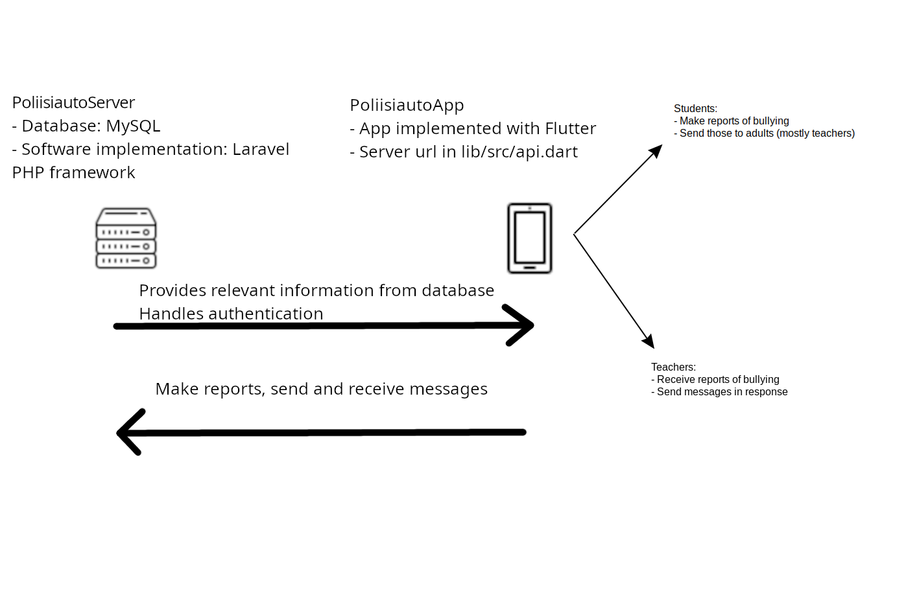

## Important notice!

**This is a prototype and must not be used in practice under any circumstances! The developers of this application do not take any responsibility, legal or otherwise, of using this application!**

---

# Poliisiauto mobile app


This project is a client application for [PoliisiautoServer](https://github.com/Spacha/PoliisiautoServer). It is an application where users can report bullying to a trusted adult.

## Getting started with development

This project is made using [Flutter](https://docs.flutter.dev/) and is targeted mainly to Android, but should also work on iOS. Flutter offers a good documentation on how to set up a development environment for it. We recommend using Visual Studio Code with Flutter extension(s) since it has proven to be a very well functioning setup. Straight up Android Studio set up with flutter and dart extensions has also been tested and it works.

You'll also need a device to test on. Most likely you want to use an Android emulator running on the same machine as the editor. Flutter documentation has a tutorial for setting up Android Studio for that purpose.

To use the system in a testing environment, you must first set up the server. Easiest is to set up a local development server using any solution proposed in the Laravel documentation. For example, you can use Docker, Homestead, Valet or your own custom
setup. When the server is running, the API is then available in /api/v1 as defined in the API routing file. You also need to create a database and run the migrations. The setup is thestandard setup for Laravel applications and there are a lot of guides for such setup. One
simplified version is available in the README of the [server repository](https://github.com/interact-rg/PoliisiautoServer). It is recommended to test the API without the mobile application first using a HTTP client such as Postman. In the header of the API description is a button “Run in Postman”,
which opens a new Postman session with pre-defined requests that match the API endpoints. The application can be tested against the server using an Android virtual device or your own smartphone. Flutter documentation has a [step-by-step guide](https://docs.flutter.dev/get-started/editor) for such a setup.
Before running the mobile application, you need to update the API endpoint to match your own server. This is done on top of the API wrapper, located in lib/src/api.dart:

```
/// initialize the global API accessor
PoliisiautoApi api = PoliisiautoApi(host: 'http://poliisiauto.local, version: 'v1');
```

As the above snippet shows, you need to provide the API’s hostname and version. The version should match to the API version defined in the server’s API routing file – it can probably be left to v1. The host name should be your PoliisiautoServer’s hostname, such
as http://localhost:8080 or http://poliisiauto.local. After these steps, you can run and start testing the application.

## Feedback given by kids, and steps to address those

| Feedback     | Possible steps  | Steps implemented |
| :---         |     :---:       |          ---: |
| Report making overly complex   | Report streamlining, one question at a time. Possibly audio input | Report making streamlined to present one question at a time. |
| Sign out -button hard to find  | Make it visible in frontpage                                      | Made it visible in frontpage                                 |
| Visual outlook could be better |                                                                   |                                                              |

## Overview of application




## License

PoliisiautoApp is licensed under a 2-clause BSD license. See [LICENSE](LICENSE) for more details.
